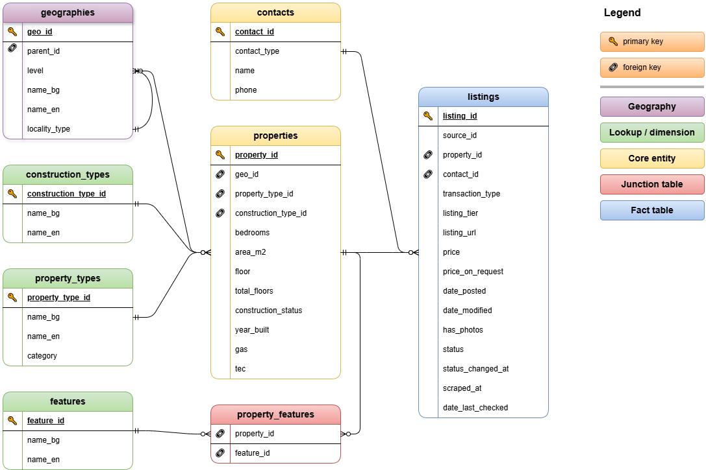

# Bulgaria Real Estate Cleaning

## Project Badges

[](https://www.python.org/)
[](https://pandas.pydata.org/)
[](https://www.postgresql.org/)
[](https://www.kaggle.com/datasets/gabrielagencheva/bulgaria-real-estate-listings/)
[](LICENSE.txt)


## Overview

A sequential Python cleaning pipeline for raw real estate listings scraped from [imot.bg](https://www.imot.bg) by the [bulgaria-real-estate-scraper](https://github.com/GabrielaY0rdanova/bulgaria-real-estate-scraper).

Supports two workflows. A full rebuild combines explicitly ordered historical sales and rental CSV files. A monthly update consumes one completed light-scraper run directory and applies its actions in a single PostgreSQL transaction. The pipeline handles field parsing, translation, transliteration, deduplication, outlier flagging and validation.

Part of a larger **Real Estate Data Platform**: [`real_estate_scraper`](https://github.com/GabrielaY0rdanova/bulgaria-real-estate-scraper) to [`real_estate_cleaning`](https://github.com/GabrielaY0rdanova/bulgaria-real-estate-cleaning) to [`real_estate_analysis`](https://github.com/GabrielaY0rdanova/bulgaria-real-estate-analysis) to `real_estate_visualization`


## Dataset

| File | Rows | Transaction type | Run |
|---|---|---|---|
| `prodazhbi_06_04_2026.csv` | 160,886 | Sales | Full scrape |
| `naemi_10_04_2026.csv` | 38,610 | Rentals | Full scrape |
| `prodazhbi_05_05_2026.csv` | 45,186 | Sales | Incremental update |
| `naemi_07_05_2026.csv` | 19,038 | Rentals | Incremental update |

The current database snapshot, after the September 2026 catch-up and rental recovery runs, contains **351,188 historical listings**. Of these, **207,146 are active**: 169,037 sales and 38,109 rentals. Historical files remain available so status transitions and price changes are preserved.

The raw and cleaned datasets are published on Kaggle: [Bulgaria Real Estate Listings](https://www.kaggle.com/datasets/gabrielagencheva/bulgaria-real-estate-listings)


## Project Structure

```
bulgaria-real-estate-cleaning/
│
├── scripts/
│   ├── 00_schema.sql           # PostgreSQL DDL: enums, tables, constraints
│   ├── 01_ingest.py            # Load and combine raw CSVs, sanity checks
│   ├── 02_audit_raw_data.py    # Null rates, value distributions to audit_report.md
│   ├── 03_clean_fields.py      # Parse and clean all raw fields to df_clean.pkl
│   ├── 04_deduplicate.py       # Dedup by source_id, keep latest to df_dedup.pkl
│   ├── 05_flag_outliers.py     # Flag price / area / year_built outliers to df_flagged.pkl
│   ├── 06_normalize.py         # Split into 8 relational tables to CSVs
│   ├── 07_validate.py          # Pre-export validation gate to validation_report.md
│   ├── 08_export.py            # Full rebuild export only
│   ├── 09_incremental_export.py # Dry-run or transactional monthly update
│   └── 10_export_database_snapshot.py # Validated read-only CSV snapshot
│
├── pipeline/                   # Input contract, staging and DB update logic
├── sql/
│   ├── 00_schema.sql           # PostgreSQL tables and constraints
│   └── 01_incremental_runs.sql # Applied-run ledger
│
├── data/
│   ├── raw/                    # Input CSVs from scraper (gitignored, on Kaggle)
│   └── clean/                  # Pickles + normalised CSVs (gitignored, on Kaggle)
│
├── docs/
│   └── erd.png                 # Entity-relationship diagram
│
├── requirements.txt
├── .env                        # DB credentials: never committed (see .env.example)
├── .gitignore
└── README.md
```


## Pipeline Architecture

The pipeline runs as eight numbered scripts in sequence. Each script has a single responsibility and passes its output forward via pickle or CSV.

```
raw CSVs
   │
   ▼
01_ingest.py         : load, combine, row-count sanity check
   │
   ▼
02_audit_raw_data.py : audit_report.md (null rates, distributions)
   │
   ▼
03_clean_fields.py   : parse prices, dates, floors, phones, enums to df_clean.pkl
   │
   ▼
04_deduplicate.py    : dedup by source_id, keep latest scraped_at to df_dedup.pkl
   │
   ▼
05_flag_outliers.py  : IQR outlier flags, no rows removed to df_flagged.pkl
   │
   ▼
06_normalize.py      : split into 9 relational tables to CSVs
   │
   ▼
07_validate.py       : 3-tier validation gate, blocks export on failure
   │
   ▼
08_export.py         : bulk COPY into PostgreSQL, post-load row count check
```


## Schema

Nine data tables plus the `pipeline_runs` ledger are stored in PostgreSQL. See `sql/00_schema.sql` and `sql/01_incremental_runs.sql` for the DDL.



| Table | Rows | Description |
|---|---|---|
| `geographies` | 4,598 | Hierarchical: region to locality to area |
| `construction_types` | 6 | Lookup: brick, panel, timber frame, etc. |
| `property_types` | 46 | Lookup: apartment, house, office, plot, etc. |
| `features` | 46 | Lookup: elevator, furnished, parking, etc. |
| `contacts` | 49,504 | Deduplicated agencies and owners |
| `properties` | 351,188 | Physical attributes linked one-to-one with listings |
| `listings` | 351,188 | Historical advertisements with active/inactive status |
| `property_features` | 882,057 | Many-to-many property-feature relationships |
| `price_history` | 49,458 | Recorded price transitions across scraper runs |


## What Each Script Does

### `03_clean_fields.py`: Field Parsing

| Field | Raw format | Cleaned to |
|---|---|---|
| `price` | `"89 990 €"` / `"Цена при запитване"` | `float` + `price_on_request bool` |
| `floor` | `"3 от 9"` | `floor int` + `total_floors int` |
| `date_posted` / `date_modified` | `"Публикувана в 15:55 на 6 април, 2026 год."` | `Timestamp` |
| `property_type` | `"3-СТАЕН"` | `"apartment"` + `bedrooms = 3` |
| `construction_type` | `"Тухла"` | `"brick"` |
| `tec` | `"ДА"` | `"district_heating"` |
| `gas` | `"ДА"` / `"НЕ"` | `True` / `False` |
| `agency_phone` | `"359888355153"` / `"885355153.0"` | `"0888355153"` |
| `poster_type` | `"агенция"` / `"собственик"` | `"agency"` / `"owner"` |
| `locality_type` | `"град"` / `"к.к."` | `"city"` / `"resort_complex"` |

Phone normalisation handles six cases: float `.0` artifacts from pandas, country code `359` prefix, missing leading zero on both mobiles (10 digits) and landlines (9 digits), and masked placeholder numbers redacted by imot.bg.

### `04_deduplicate.py`: Deduplication

The scraper appends without deduplication by design, so the same `source_id` may appear more than once across runs. The dedup step keeps the row with the latest `scraped_at` per `source_id` and sets `date_last_checked` to match. `status_changed_at` is set to `NULL` on first load: it is only populated in future incremental runs when a listing transitions between `active` and `inactive`.

### `05_flag_outliers.py`: Outlier Flagging

Adds three boolean flag columns: no rows are removed. Outlier decisions belong in analysis.

| Flag | Method |
|---|---|
| `price_outlier` | IQR × 3.0 per `property_type_en` group (groups < 10 rows skipped) |
| `area_outlier` | Global IQR × 3.0; `area_m2 = 0` always flagged |
| `year_built_outlier` | Hard range: < 1800 or > 2040 |
| `is_future_property` | `year_built > current year`: off-plan listings with projected completion dates |

### `06_normalize.py`: Normalisation

Splits the flat DataFrame into the eight relational tables. Builds surrogate integer keys, resolves foreign keys, transliterates Bulgarian Cyrillic geography names to Latin script using the Streamlined Transliteration System, and parses the comma-separated `features` string into a proper junction table.

Contact deduplication merges agency rows on `(contact_type, name, phone)`. Owner rows with both `name` and `phone` null each get their own row: there is no reliable basis for merging them.

### `07_validate.py`: Validation Gate

Three tiers of checks. Exits non-zero on any Tier 1 or Tier 2 failure, blocking `08_export.py` in a shell pipeline.

| Tier | Checks | On failure |
|---|---|---|
| Tier 1: Referential integrity | 7 FK checks across all tables | Blocking |
| Tier 2: Business rules | price ↔ price_on_request, floor parity, date ordering, year range, etc. | Blocking |
| Tier 3: Distribution sanity | Null rate bounds, price range by transaction type, row count parity | Warning only |


## How to Run

### 1. Clone and set up environment

```bash
git clone https://github.com/GabrielaY0rdanova/bulgaria-real-estate-cleaning.git
cd bulgaria-real-estate-cleaning
conda create -n re_cleaner python=3.11
conda activate re_cleaner
pip install -r requirements.txt
```

### 2. Add raw data

Download the dataset from Kaggle and place the CSVs in `data/raw/`:

```
data/raw/
    prodazhbi_06_04_2026.csv
    naemi_10_04_2026.csv
```

### 3. Apply the schema

Run the DDL against your PostgreSQL database:

```bash
psql -U postgres -d your_database -f scripts/00_schema.sql
```

### 4. Configure database connection

Create a `.env` file in the project root:

```
PGHOST=localhost
PGPORT=5432
PGUSER=postgres
PGPASSWORD=your_password
PGDATABASE=your_database
```

### 5. Run a full rebuild

```bash
python scripts/01_ingest.py --full-file data/raw/prodazhbi_06_04_2026.csv --full-file data/raw/naemi_10_04_2026.csv --full-file data/raw/prodazhbi_05_05_2026.csv --full-file data/raw/naemi_07_05_2026.csv --full-file data/raw/prodazhbi_27_07_2026.csv --full-file data/raw/naemi_29_07_2026.csv
python scripts/02_audit_raw_data.py
python scripts/03_clean_fields.py
python scripts/04_deduplicate.py
python scripts/05_flag_outliers.py
python scripts/06_normalize.py
python scripts/07_validate.py && python scripts/08_export.py
```

`07_validate.py` must pass before `08_export.py` runs. The `&&` operator enforces this: export is skipped automatically if validation fails.

### 6. Validate a monthly run without changing PostgreSQL

Pass the completed light-scraper run directory to the ingest step. Do not pass
individual monthly CSV files.

```bash
python scripts/01_ingest.py --run-dir "path/to/data/runs/<run_id>"
python scripts/02_audit_raw_data.py
python scripts/03_clean_fields.py
python scripts/04_deduplicate.py
python scripts/05_flag_outliers.py
python scripts/09_incremental_export.py
```

The last command is a dry run by default. It validates the cleaned rows and
actions but does not open PostgreSQL.

Before the first real monthly update, apply the run-ledger migration once:

```bash
psql -U postgres -d your_database -f sql/01_incremental_runs.sql
```

After you confirm the database backup and review the dry-run counts, apply the
same staged run:

```bash
python scripts/09_incremental_export.py --apply
python scripts/10_export_database_snapshot.py --target-database your_database
```

The updater uses one transaction. It never runs `TRUNCATE`, refuses a repeated
`run_id`, checks existing `listing_id` and price values, and rolls back the
whole run if any row fails. The final command opens the database in read-only
mode and exports all normalized tables to temporary files. Existing clean CSVs
are replaced only after every table passes its row-count check.

A transaction-specific recovery run, for example `--only naemi`, follows the
same steps. Empty files for the excluded transaction are valid no-op inputs.
The staging layer ignores those empty frames without changing inferred dtypes.


## Technologies

- **Python 3.11**
- **pandas 2.2**: all data processing
- **psycopg2-binary**: PostgreSQL connection and bulk COPY
- **python-dotenv**: database credentials management
- **PostgreSQL 18**: target database with full relational schema


## Notes

- **One property per listing**: the schema does not attempt to identify the same physical property across multiple listings. Each listing gets its own `properties` row. This is intentional: cross-listing property identity would require fuzzy matching that belongs in the analysis stage.
- **Outliers are flagged, not removed**: the `price_outlier`, `area_outlier`, and `year_built_outlier` flags are informational. A €5M apartment may be genuine; a €5M parking space probably is not. That judgment belongs in analysis.
- **Future properties**: listings with `year_built > current year` are off-plan properties advertising projected completion dates. These are flagged as `is_future_property` and kept in the dataset.
- **Bulgarian phone numbers**: both mobile (10 digits, 08x/09x) and landline (9 digits, 02x/03x) formats are normalised to a canonical leading-zero string. Numbers masked by imot.bg (ending in `000000`) are set to null.
- **Geography transliteration**: region, locality, and area names are stored in both Cyrillic (`name_bg` in CSVs) and Latin script (`name_en`) using Bulgaria's official Streamlined Transliteration System. The DDL `geographies.name` column stores the Cyrillic form.


## License

This project is licensed under the [MIT License](LICENSE.txt) and is available for educational and portfolio purposes.
